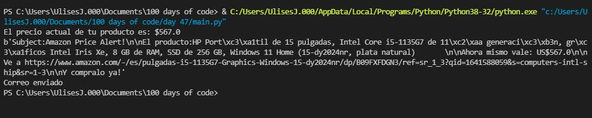
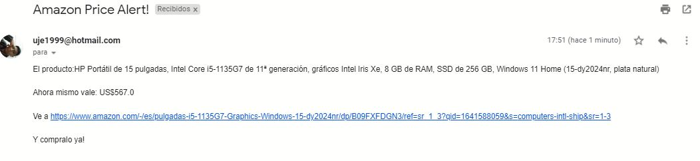

# Automated Amazon price tracker

Identifique el producto que quería en amazon

Con ayuda de BeautifulSoup4 y añadiendo los headers adecuados para mi navegador obtuve el precio actual del producto y en el código incluí mi precio de compra deseado. Bataría con hacer que el script se ejecute periodicamente una vez cada 3 días por ejemplo y cuando encuentre que el precio del producto es menor que mi precio deseado, creará un mensaje con el siguiente contenido.

Finalmente me notificará via email para que no me olvide de adquirir mi producto

